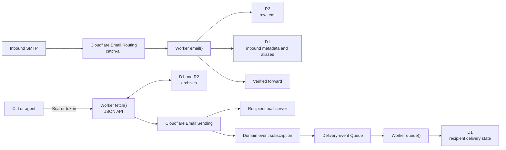

# mailsink

Mailsink is a self-hosted email sink for domains on Cloudflare.
It uses disposable aliases that do not need registration.

Mailsink can receive, store, forward, send, reply to, and delete email.
One authenticated Worker supplies the JSON API.

## System overview



## Main behavior

- An alias exists after its first inbound message or outbound send.
- You can block an alias before it receives a message.
- You can also add a route before an alias receives a message.
- The default block mode rejects new mail during the SMTP transaction.
- A blocked alias cannot send mail.
- Mailsink stores the raw RFC 5322 message in R2 before it parses the message.
- D1 stores searchable metadata and a shortened text body.
- Each alias can forward to one verified destination.
- Mailsink stores the message before it tries to forward the message.
- Mailsink folds `name+tag` into the `name` alias.
- One Worker can serve more than one domain.
- Each outbound send names its sender.
- Mailsink stores the structured outbound payload before it submits the message.
- Queue events update the delivery state for each recipient.
- A repeated send ID returns the first send record.
- A reply uses the inbound reply address and thread headers.

## Requirements

- Node.js 24 or later.
- pnpm 11.
- A Cloudflare account.
- A domain that uses Cloudflare DNS.

> **CAUTION:** Email Routing changes the domain MX records.
> Do not continue if another service must receive all inbound mail for the domain.

## Get started

Install the packages from the repository root.

```bash
pnpm install --frozen-lockfile
```

Create the storage resources from `packages/worker`.

```bash
cd packages/worker
npx wrangler login
npx wrangler d1 create mailsink
cp wrangler.toml.example wrangler.toml
```

Copy the new D1 `database_id` value to `wrangler.toml`.
Then create the other resources and deploy the Worker.

```bash
npx wrangler r2 bucket create mailsink-raw
npx wrangler queues create mailsink-email-events
npx wrangler d1 migrations apply mailsink --remote
npx wrangler deploy
```

Enable Email Routing for the domain.
Set the catch-all action to **Send to a Worker**.
Select the deployed `mailsink` Worker.

Initialize the CLI from `packages/cli`.

```bash
cd ../cli
pnpm run dev init --cloudflare
```

This command creates the Worker API token.
It uploads the token as a Worker secret.
It also validates the API and stores the token in the operating system credential store.

Use the complete [getting-started guide](docs/getting-started.md) for all deployment steps.

## Enable outbound sending

Run the guided command from `packages/cli`.

```bash
pnpm run dev setup sending [domain]
```

This command creates or checks the `mailsink-email-events` Queue.
It does not enable the sending domain or deploy the Worker.

Wrangler can enable Email Sending and inspect its DNS records.
The Worker configuration declares the Queue consumer.
Wrangler applies this binding when it deploys the Worker.
The Cloudflare dashboard or API can create the domain event subscription.
Deploy the Worker after you complete these steps.

Do not replace an existing DMARC record.
Use `p=none` while you validate a new sending domain.

Read the [configuration guide](docs/configuration.md) for the required bindings and setup sequence.

## Use the CLI

Examples in this section run the CLI from `packages/cli`.
An installed package uses the `mailsink` command instead.

```bash
pnpm run dev latest netflix --from netflix
pnpm run dev ls inbox netflix
pnpm run dev show <inbound-id>
pnpm run dev raw <inbound-id> -o message.eml

pnpm run dev burn promo-new@example.com
pnpm run dev unburn promo-new@example.com
pnpm run dev note netflix "netflix trial 2026-06"

pnpm run dev route
pnpm run dev route support@example.com may@email.com
pnpm run dev route support@example.com --remove
pnpm run dev provider gmail support@example.com

pnpm run dev send recipient@example.net \
  --from agent@example.com \
  --subject "Hello" \
  --text "Message text"

pnpm run dev reply <inbound-id> --text "Reply text"
pnpm run dev ls sent support --status delivered
pnpm run dev payload <sent-id>

pnpm run dev rm <email-id>
pnpm run dev purge inbox netflix --yes
pnpm run dev purge sent support --yes
```

Put global options before the command.

```bash
pnpm run dev --json latest netflix
pnpm run dev --domain example.com latest netflix
pnpm run dev --exact burn netflix-x7f2
```

Read the complete [CLI guide](packages/cli/USAGE.md) for command behavior and alias matching.

## API

All API routes use the `/v1` base path.
All routes require `Authorization: Bearer <API_TOKEN>`.

The API has these resource groups:

| Resource | Operations |
|---|---|
| `/v1/emails` | List, read, download raw mail, reply, delete, and purge. |
| `/v1/aliases` | List, block, unblock, annotate, add a route, and remove a route. |
| `/v1/sent` | Submit, list, inspect, read payloads, delete, and purge. |

Read [SPEC.md section 7](SPEC.md#7-http-api-fetch-handler) for the complete API contract.

## Repository layout

| Package | Purpose |
|---|---|
| [`packages/shared`](packages/shared/) | Contains the shared API types and route constants. |
| [`packages/worker`](packages/worker/) | Contains the Worker handlers, migrations, and tests. |
| [`packages/cli`](packages/cli/) | Contains the Node.js CLI and its tests. |

## Development

Run all deterministic checks from the repository root.

```bash
pnpm test
pnpm run typecheck
pnpm --dir packages/cli run build
```

Run the local Worker from `packages/worker`.

```bash
pnpm run dev
```

Read the [development guide](docs/development.md) for local email injection and focused checks.

## Known limitations

- Mailsink is for one trusted operator.
- It uses one bearer token and has no application rate limit.
- Each alias has one forwarding destination.
- Mailsink does not retry an immediate forwarding failure.
- Mailsink makes one provider submission for each send ID.
- Cloudflare can retry delivery after it accepts the submission.
- A `delivered` event means that the recipient mail server accepted the message.
- A `delivered` event does not prove mailbox receipt.
- D1 stores a maximum of 65,536 characters from an inbound text body.
- Use the raw `.eml` file for the complete content.
- Mailsink has no automatic retention or orphan removal.
- Mailsink has no web user interface, full-text search, attachment extraction, or push notifications.
- Live end-to-end checks require real Cloudflare credentials and mailbox confirmation.
- `pnpm test` does not run the live checks.

Read [Cloudflare platform limitations](docs/LIMITATIONS.md) for Email Service
constraints and local-test boundaries.

## Cost and delivery

Cloudflare marks Email Sending as a beta service.
Email Routing is available on the Workers Free and Workers Paid plans.
Sending to verified destination addresses is free on both plans.
Sending to arbitrary recipients requires the Workers Paid plan.

The Workers Paid plan includes 3,000 outbound messages each month.
Additional messages cost $0.35 for each 1,000 messages.
Cloudflare applies an adaptive daily sending limit to each account.

A provider `messageId` proves only that Cloudflare accepted the submission.
Use Queue state and a real mailbox to verify delivery.

See the current Cloudflare [limits](https://developers.cloudflare.com/email-service/platform/limits/) and [pricing](https://developers.cloudflare.com/email-service/platform/pricing/).

## Documentation

- [User documentation](docs/README.md)
- [Getting started](docs/getting-started.md)
- [Configuration](docs/configuration.md)
- [CLI guide](packages/cli/USAGE.md)
- [Development](docs/development.md)
- [Cloudflare Email Service test strategy](docs/cloudflare-email-service-testing.md)
- [Cloudflare platform limitations](docs/LIMITATIONS.md)
- [System specification](SPEC.md)
- [Decision log](DECISIONS.md)

Deferred features are listed in [SPEC.md section 13](SPEC.md#13-deferred-features).
